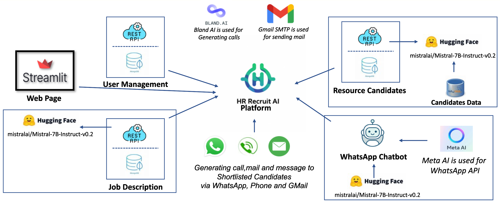
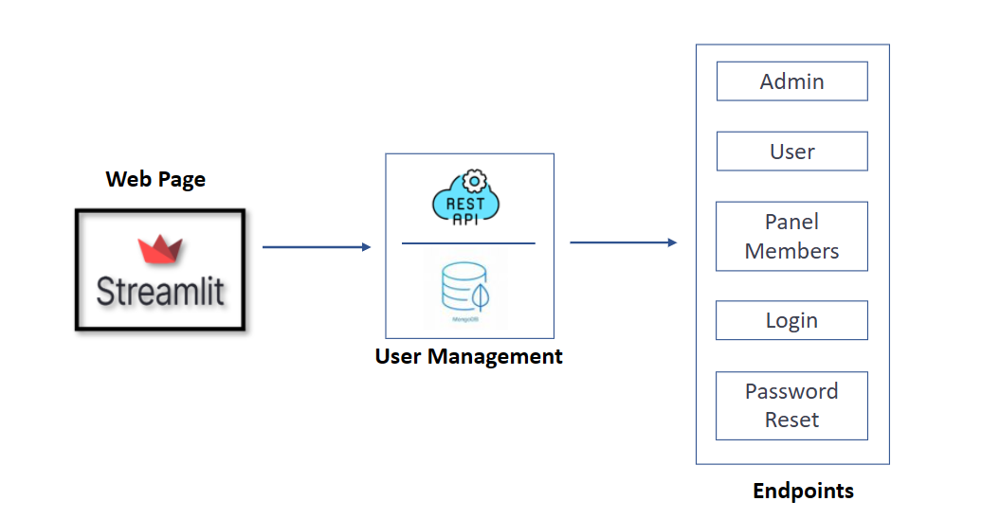
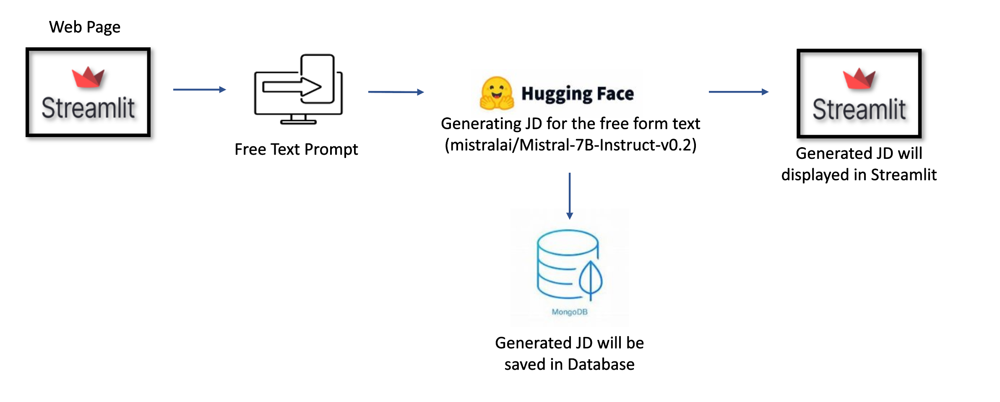
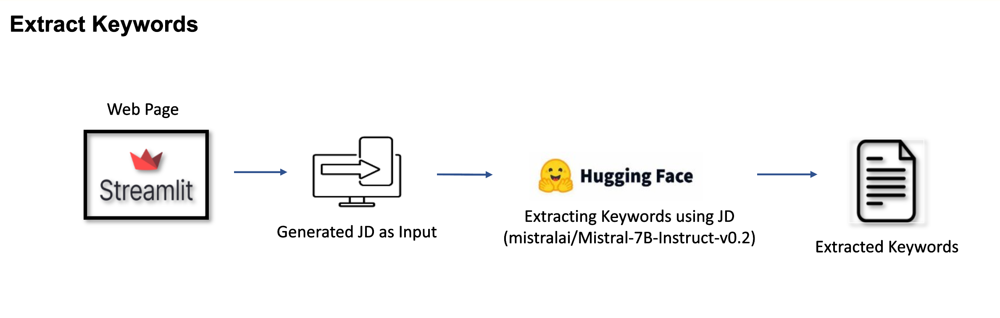
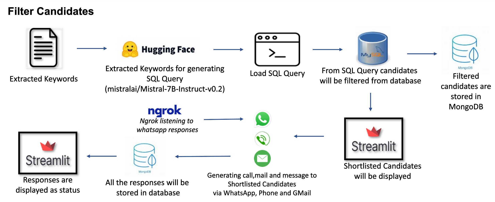

## **HR Recruiter AI**

In the fast-paced world of IT recruitment, finding the right candidate can be a daunting task. Enter **HR Recruiter AI**, a cutting-edge solution designed to streamline the recruitment process using Generative AI (GAI). This innovative platform automates key tasks, saving time and enhancing decision-making for HR professionals.

## **The Architecture of HR Recruiter AI**

At the heart of HR Recruiter AI is a robust architecture that integrates various AI models and tools to deliver a seamless experience. The platform leverages **Streamlit** for web page creation, ensuring an intuitive and user-friendly interface. 

*Figure 1: The architecture of HR Recruiter AI, showcasing the integration of various AI models and tools.*

## **Key Features**

### **User Management**
The system includes a comprehensive user management module with features like admin and user panels, 
login, and password reset functionalities.

**How it works:** Administrators can manage users and panel members efficiently, ensuring secure access to the platform.

*Figure 1: User management interface in HR Recruiter AI, highlighting admin and user panels.*

### **Job Description Generation**
The platform uses **Mistral-7B-Instruct-v0.2** from Hugging Face to generate job descriptions based on free text prompts. These descriptions are then saved in a database and displayed via Streamlit.

**How it works:** HR professionals input free text prompts, and the AI generates detailed job descriptions.

*Figure 2: The process of generating job descriptions using free text prompts and AI models.*

### **Candidate Shortlisting**
HR Recruiter AI employs **Bland AI** for generating calls and **Gmail SMTP** for sending emails. It also integrates with **Meta AI** for WhatsApp API, enabling communication with shortlisted candidates via WhatsApp, phone, and email.

**How it works:** The platform automates communication with shortlisted candidates through various channels.

### **Keyword Extraction** 
The platform extracts keywords from generated job descriptions using Mistral-7B-Instruct-v0.2, aiding in the efficient shortlisting of candidates.

**How it works:** Keywords are extracted from job descriptions to refine the candidate search process.

*Figure 3: Extracting keywords from job descriptions to aid in candidate shortlisting.*
 
#### **Candidate Filtering** 
The platform filters candidates based on extracted keywords, generating SQL queries to retrieve relevant profiles from the database. These filtered candidates are stored in MongoDB, and all responses are logged for future reference.

**How it Works:** Using the extracted keywords, the platform generates SQL queries to filter candidates from the database. The filtered candidates are stored in MongoDB and displayed via Streamlit.

*Figure 4: The process of filtering candidates using extracted keywords and storing them in MongoDB.*

## **Conclusion**

HR Recruiter AI is set to revolutionize the recruitment process in the IT sector. By automating repetitive tasks and leveraging advanced AI models, it allows HR professionals to focus on what truly matters—finding the best talent. As AI continues to evolve, platforms like HR Recruiter AI will play a pivotal role in shaping the future of recruitment.

This blog provides a glimpse into the transformative potential of AI in HR recruitment. As we move forward, the integration of such technologies will undoubtedly become a standard, making the recruitment process more efficient and effective.